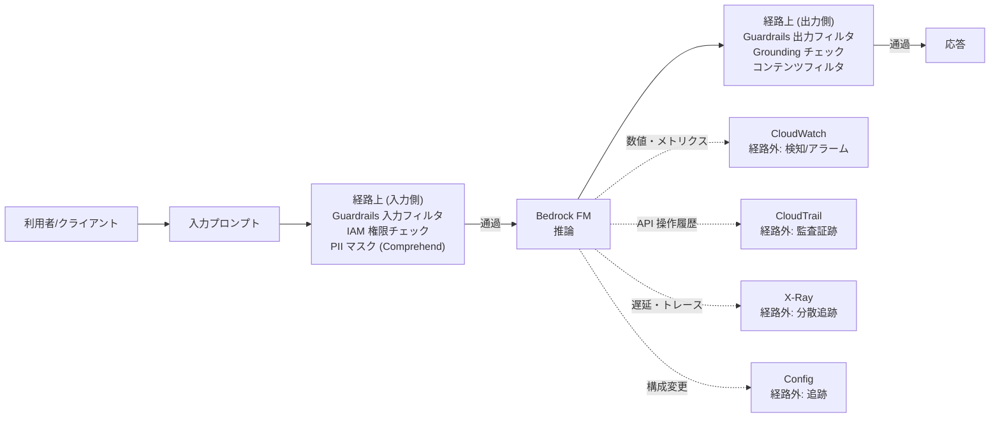
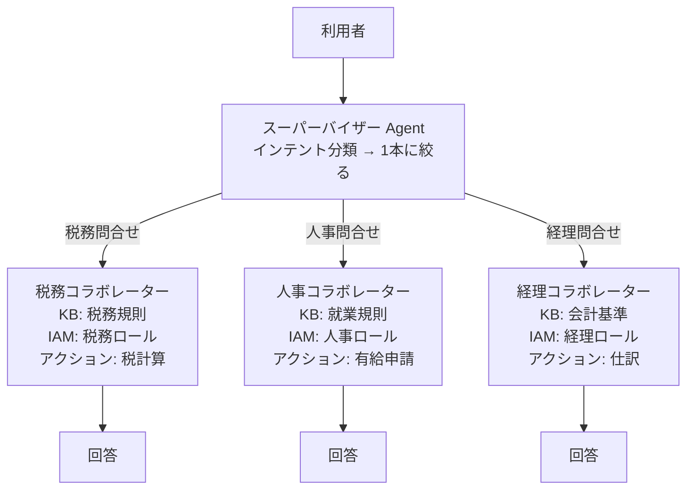
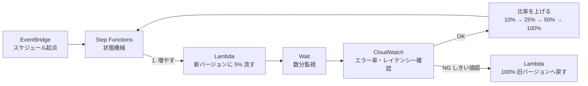
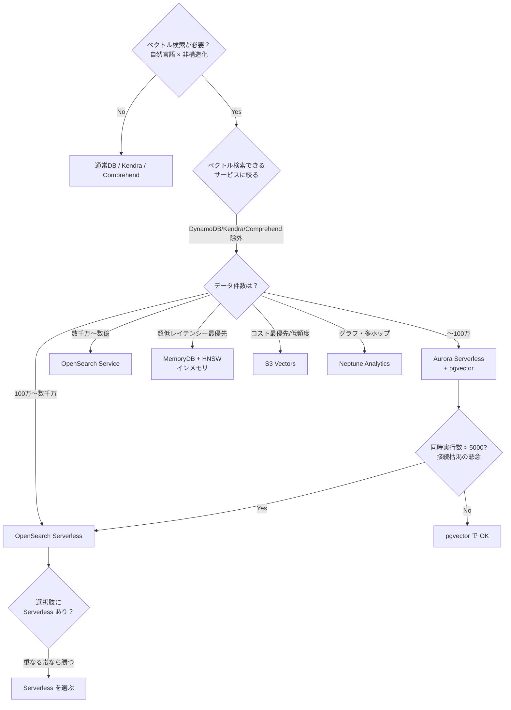
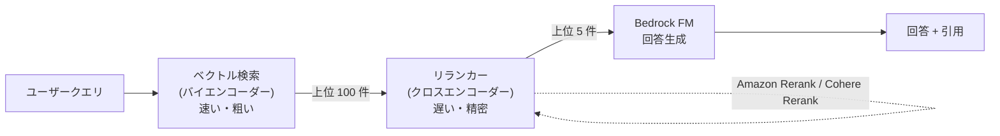
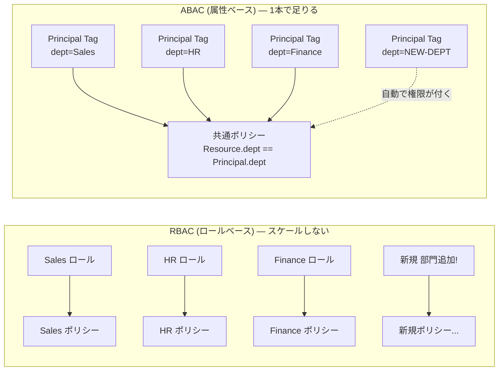

# AWS 生成AI 試験直前ノート

> [!summary]
> [[Amazon Bedrock]] 中心の生成AI 資格演習20問から、横断的な判断軸とサービス別知識を整理したもの。上から順に読めば直前確認になる構成で、[[RAG]] のベクトルストア選定・チャンキング・評価・可観測性・[[IAM]] セキュリティまでを網羅する。演習解説の誤り5件も §1 に記録済み。

関連トピック: [[Amazon Bedrock]] / [[RAG]] / [[OpenSearch]] / [[pgvector]] / [[Guardrails]] / [[Step Functions]] / [[X-Ray]] / [[ABAC]]

---

## 0. 最優先チェック（試験開始5分前に読む）

1. **要件の動詞を見る** — 「ブロック/フィルタ/適用」＝経路上のサービス、「監視/検知/記録」＝経路外のサービス
2. **開発工数 = 自分で書くコード量**。マネージドへの移行は工数を「減らす」
3. **パイプラインは最も遅い段で決まる** — 1つでもバッチが混ざれば全体がバッチ
4. **ベクトル検索のサイン** = 自然言語入力 × 非構造化データ
5. **規模には2軸** — データ件数 と 同時実行数（QPS）
6. **重なる帯では件数で決まらない** — 「Serverless」と書いてある方が勝つ
7. **専用機能を先に探す** — 汎用サービスの組み合わせは大抵不正解
8. **要件を数えてチェック表** — 全部埋める選択肢が1つだけあればそれが答え
9. **Bedrock なのに SageMaker のツール**が出てきたら疑う
10. **手動レビュー・事後監査は、自動ゲート要件と衝突する**

---

## 1. 解説が誤っていた点（要注意・5件）

演習問題の解説をそのまま覚えると事故る箇所。

| # | 解説の記述 | 実際 |
|---|---|---|
| 1 | 「Amazon [[S3 Vectors]] は実在しないサービス」 | **実在する**。2025年12月にGA。数十億ベクター、専用DBより最大90%安い。Bedrock KB のベクトルストアとして統合可 |
| 2 | 「Amazon Nova Pro は有効な評価モデル名ではない」 | **使える**。LLM-as-a-judge の評価モデルとして選択可能 |
| 3 | 「GuardrailContentSource ディメンションで人口統計グループ別に追跡」 | ディメンション値は **Input / Output の2つだけ**。属性別の分割は不可 |
| 4 | 「RetrieveAndGenerate にストリーミング版はない」 | **`RetrieveAndGenerateStream` が存在**（2024年12月〜） |
| 5 | 「[[Prompt Management]] は承認ワークフローをネイティブサポート」 | **専用機能はない**。IAM + イミュータブルなバージョン + [[CloudTrail]] で代替する |

> 解説文より **選択肢の文面** を信じる。選択肢は正しく書かれていることが多い。

---

## 2. 横断的な判断軸

### 2-1. 経路上か経路外か（最重要）

```
[経路上：止められる]  Guardrails / Rekognition / Comprehend / 評価ゲート / IAM
[経路外：止められない] CloudWatch / CloudTrail / Config / CloudTrail Insights / 事後監査
```

- 「フィルタリング」「ブロック」「防止」「適用(enforce)」→ 経路上
- 「検知して知らせる」「傾向を追う」「記録する」→ 経路外
- **両者は併用が正しい姿**。Guardrails でブロック → CloudWatch で件数監視、など



**経路上は止められる／経路外は記録するだけ**。要件動詞が「ブロック」「防止」「適用」なら経路上のサービスを選ぶ。

### 2-2. 「最小の開発/運用オーバーヘッド」の読み方

> 開発工数 = **自分で書いて保守するコードの量**。インフラの大きさではない。

- 赤信号ワード：「カスタム〜を構築」「チューニング」「ルール実装」「独自実装」「外部ロジック」
- 青信号ワード：「組み込み」「マネージド」「Serverless」「1回のAPIコールで」
- 既存DBに拡張を足す方が楽に見えて、実は運用が重いことがある（pgvector の大規模ケース）

### 2-3. 要件チェックリスト法

多層セキュリティ・ガバナンス系はこれが最速。

1. 問題文から要件を箇条書きで数える
2. 各選択肢が何個カバーするか数える
3. 全部カバーするものを選ぶ（個々の技術の妥当性は深追いしない）

### 2-4. 時間軸で切る

| 要件の表現 | 置く場所 |
|---|---|
| デプロイをブロック / リリースを止める | **事前ゲート**（評価ジョブ + CI/CD） |
| リアルタイムで監視・アラート | **稼働中**（CloudWatch） |
| 週次レポート / 事後監査 | 事後（要件が「ブロック」なら不正解） |

### 2-5. 既存スタックに寄せる

問題文がフレームワーク・スタックを列挙していたら、それは**制約条件**。
そのスタック向けに用意されたツールが答え（例：React + [[Amplify]] + [[AppSync]] → Amplify AI Kit）。
既にある仕組み（AppSync の Subscription）で足りることに、新サービス（API Gateway WebSocket）を足す選択肢は疑う。

---

## 3. Bedrock 中核サービスの役割マップ

### 3-1. 実行時に効く / 後から見る

| | サービス | 一言 |
|---|---|---|
| **実行時** | Prompt Management | 何を頼むか |
| **実行時** | Flows | どう繋ぐか |
| **実行時** | Guardrails | 何を通すか |
| **実行時** | [[Knowledge Bases]] | どこから根拠を取るか |
| 後から | CloudWatch | 数値を見る（どれくらい？） |
| 後から | CloudTrail | 操作の記録（誰が？） |
| 後から | [[X-Ray]] | 経路の可視化（どこで遅い？） |
| 後から | [[Model Evaluation]] | 品質を測る |

### 3-2. Guardrails — できること / できないこと

**できる**
- コンテンツフィルタ（憎悪・侮辱・性的・暴力・不正行為 + **プロンプト攻撃**）、強度4段階、入力/出力別設定
- **拒否トピック（denied topics）** — 自然言語でトピック定義、意味的にブロック
- ワードフィルタ、機密情報フィルタ（PII をブロック or マスク、正規表現も可）
- **コンテキストグラウンディングチェック** — 参照ソースとの整合性 → ハルシネーション検出
- Automated Reasoning checks（形式論理でポリシー準拠を検証）
- **ApplyGuardrail API** — モデル呼び出しと独立に実行可。Bedrock 外のモデルにも適用可

**できない**
- ❌ レイテンシー改善（むしろ増える）
- ❌ 出力の一貫性・再現性
- ❌ プロンプトのバージョン管理
- ❌ 公平性・バイアスの測定
- ❌ 画像モデレーション（→ Rekognition Content Moderation）

### 3-3. Prompt Management — できること / できないこと

**できる**：プロンプトライブラリ（ARN 参照）／**イミュータブルなバージョニング**／変数 `{{var}}` によるパラメータ化／**推論パラメータ（temperature 等）の同梱**／バリアント比較／Flows・Agents 連携／プロンプト最適化

**できない**：❌ 安全性の強制 ❌ ハルシネーション検出 ❌ レイテンシー保証 ❌ 本番トラフィックのA/Bルーティング ❌ 承認ワークフロー（IAM で代替）

> **一貫性 → Prompt Management**（バージョン固定 + パラメータ固定）
> **安全性 → Guardrails**
> システムプロンプトに「危険なことを言うな」と書くのは *お願い*。Guardrails は *強制*。

### 3-4. Knowledge Bases

- **KB は検索エンジンではなく「RAG のパッケージ」**
- `RetrieveAndGenerate` のレスポンスに `citations` が含まれる
  - `generatedResponsePart`（回答のどの部分が）× `retrievedReferences`（どのチャンクに基づくか）
  - → 一文ごとに根拠が紐づく。規制業界の追跡可能性要件を直接満たす
- 裏側のベクトルストアは OpenSearch Serverless、S3 Vectors など

| API | 守備範囲 |
|---|---|
| `Retrieve` | 検索のみ（独自リランキング・複数KBマージ・自前プロンプトが要るとき） |
| `RetrieveAndGenerate` | 検索 → 生成 → 引用付与を1コール |
| `RetrieveAndGenerateStream` | 上記のストリーミング版 |

### 3-5. Agents（マルチエージェント）

- **スーパーバイザー**：インテント分類 → コラボレーターへ委譲
- **コラボレーター**：ドメイン別。専用 KB とアクションを持つ
- モード：`supervisor`（毎回統括）/ `supervisor with routing`（明確なものは直接委譲＝低レイテンシー）
- 階層は **2段が基本**。中間層がルーティング判断をしないなら不要
- 全エージェントへの並列送信は誤り（**扇形に広げるのは検索。エージェントは分類して1本に絞る**）
- データ分離は **KB を分けて IAM ロールで**（プロンプトで制御しない）



**要点**: KB とロールを**コラボレーターごとに分ける**ことでデータ分離が成立。プロンプトに「税務データにアクセスするな」と書くのは*お願い*、IAM が*強制*。

### 3-6. Flows と [[Step Functions]]

| | 範囲 |
|---|---|
| **Bedrock Flows** | Bedrock 内で完結する生成AIワークフロー（プロンプト/KB/[[Lambda]]/条件ノード） |
| **Step Functions** | AWS サービス横断。**「待機」「条件分岐」「ロールバック」が要件なら必ずこれ** |

> **「待つ」が要件に入ったら Step Functions**（Lambda は15分上限、状態を持てない）

### 3-7. Provisioned Throughput

選ぶ条件は2つ：**レイテンシー保証が要件** / **カスタムモデル・特定バージョンの固定**。
バッチや社内ツールで選ぶと過剰投資の不正解。

**Bedrock にトラフィック分割の組み込み機能はない**（SageMaker のバリアント重みとは違う）。
カナリーは EventBridge（起点）+ Step Functions（増やす・待つ・測る・戻す）で自作する。



**「待つ」「条件分岐」「ロールバック」が要件に入ったら Step Functions**。Lambda 単体では 15 分上限 & 状態持てないので不可。

---

## 4. 推論 API の整理

|  | 一括レスポンス | ストリーミング |
|---|---|---|
| **モデル固有スキーマ** | `InvokeModel` | `InvokeModelWithResponseStream` |
| **統一スキーマ** | `Converse` | `ConverseStream` |
| **KB 経由（RAG）** | `RetrieveAndGenerate` | `RetrieveAndGenerateStream` |

- **`InvokeModel` は同期**。全トークン生成後に返る → 低レイテンシー要件では落ちる
- **ストリーミング版**：HTTP/2 イベントストリームでチャンクが届く。**短くなるのは TTFT（最初の1文字まで）だけ**で、全生成時間は変わらない
  - エラーは受信ループ内にも流れてくる（`modelStreamErrorException` 等）
- **Converse 系の利点**：モデル差の吸収、`toolConfig`、`system`、画像/文書の統一入力
- **Converse は会話モデルのみ**。埋め込み・画像生成は `InvokeModel`

### ストリーミングの実現方法（土台で変わる）

| スタック | 手段 |
|---|---|
| React + Amplify + AppSync | **Amplify AI Kit**（GraphQL Subscription） |
| 独自フロント + API Gateway | **WebSocket API** |
| Lambda 単体 | Lambda response streaming |

---

## 5. ベクトルストアの選び方

### 5-1. 2軸で考える

- **横軸：データ件数**
- **縦軸：同時実行数（QPS）** ← 「10,000人以上の同時ユーザー」「5,000万MAU」はこちら

**件数が小さくても、同時実行数が高ければ OpenSearch。**
pgvector が同時接続に弱い理由：接続ごとにプロセス／Lambda でコネクション枯渇（RDS Proxy が要る）／ベクトル検索は CPU を食う。

### 5-2. 目安

| 件数 | 第一候補 | 理由 |
|---|---|---|
| 〜100万 | **[[Aurora]] Serverless v2 + pgvector** | 既存DBに同居、SQL で メタデータ + ベクトルを一括処理 |
| 100万〜数千万 | **OpenSearch Serverless** | フィルタ付きANN、運用最小 |
| 数千万〜数億 | **OpenSearch Service** | チューニングとコスト最適化 |
| 超低レイテンシー最優先 | **[[MemoryDB]] + [[HNSW]]** | インメモリ、垂直スケールが基本 |
| コスト最優先・低頻度 | **S3 Vectors** | 安い。コールド1秒未満/ウォーム100ms |
| グラフ・多ホップ | **[[Neptune Analytics]]** | 関係性の探索 |

**ベクトル検索を持たない**：DynamoDB、[[Kendra]]（検索は別方式）、Comprehend

### 5-3. 3事例の比較（帯が重なる領域の決着）

| 事例 | 件数 | pgvector 側の記述 | OpenSearch 側の記述 | 答え |
|---|---|---|---|---|
| レストラン | 2億 | PostgreSQL | OpenSearch Service | OpenSearch |
| 規制文書 | 1000万 | Aurora PostgreSQL（通常） | OpenSearch **Serverless** | OpenSearch |
| 大学アーカイブ | 100万未満 | Aurora **Serverless** | OpenSearch Service（通常クラスタ） | **pgvector** |

> 重なる帯では、**選択肢に "Serverless" と書いてある方**が「運用最小」要件で勝つ。

### 5-4. ANN アルゴリズム

|  | 探し方 | 再現率 | 速度 | メモリ | 事前学習 |
|---|---|---|---|---|---|
| **Flat** | 全件と総当たり | **100%（厳密解）** | 件数に比例して悪化 | 小 | 不要 |
| **[[IVFFlat]]** | クラスタ分割し一部を探索 | 中（nprobe で調整） | 速い | 中 | **必要** |
| **HNSW** | 多層グラフを上から辿る | 高 | **非常に速い** | **大** | 不要 |

- **Flat は「遅い」のではなく「厳密」**。精度で負けることはない
- **IVFFlat の弱点**：小規模だとクラスタが作れない／データ追加でクラスタがズレ**再インデックスが必要**
- **HNSW**：追加はグラフに繋ぐだけ。「小規模だが成長する」に最適。代償はメモリ

判断：数千以下＋厳密解 → Flat ／ 小〜中規模でバランス → **HNSW（試験のデフォルト解）** ／ 数千万〜億でメモリコストが問題 → IVFFlat

### 5-5. 判断の順序

1. ベクトル検索が要るか（自然言語入力 × 非構造化データ）
2. ベクトル検索**ができる**選択肢はどれか（DynamoDB/Kendra/Comprehend を切る）
3. 件数で切る
4. 同時実行数で切る
5. 「Serverless」と書いてある方



**判断が割れる帯**（例: 100万〜数千万）では、選択肢の文面に「**Serverless**」と書いてある方が「運用最小」要件で勝つ。

---

## 6. RAG の品質を上げる3層

| 層 | 手段 | 症状 |
|---|---|---|
| **取り込み時** | チャンキング戦略 | 文脈が途中で切れる・情報が欠ける |
| **検索時** | **リランキング** / ハイブリッド検索 / メタデータフィルタ | 関連しない文書が上位に来る |
| **測定** | 評価ジョブ | どちらが良いか比べたい |

### 6-1. チャンキング

| 戦略 | 分け方 | 向く場面 |
|---|---|---|
| デフォルト | 約300トークン | とりあえず動かす |
| 固定サイズ | 指定トークン + オーバーラップ | 構造が均質な文書 |
| **階層的（親子）** | 大きい親の中に小さい子 | 文脈を広く保ちたい技術文書 |
| **セマンティック** | 意味の切れ目で分割 | 話題が変わる長文 |
| なし | 1ファイル = 1チャンク | すでに分割済み |
| カスタム | Lambda | 独自ロジック |

> **発想の向き**：コンテキストを超えたら「全部入れる工夫」ではなく「**必要な分だけ選ぶ**」。
> 詰め込む選択肢（連結・等分割して個別処理）は原理的に負ける（lost in the middle・コスト・ノイズ）。

**階層的チャンキングの合言葉：探すのは子、渡すのは親。**
（「親チャンクを検索する」と書いてある選択肢は機構が反転していて誤り）

**セマンティックチャンキングのパラメータ**
- ブレークポイントパーセンタイル（例95%）：隣接文の埋め込み距離が上位5%なら切る。**高いほどチャンクは大きく少なくなる**
- バッファサイズ（例3文）：類似度を測る前後の文数
- 最大トークン：上限

### 6-2. リランキング

|  | ベクトル検索（バイエンコーダー） | リランカー（クロスエンコーダー） |
|---|---|---|
| 計算 | クエリと文書を**別々に**ベクトル化 | クエリと文書を**一緒に**読む |
| 速度 | 非常に速い | 遅い |
| 精度 | 粗い（話題が近いだけで拾う） | 精密（答えになっているか判定） |
| 対象 | 全件 | 上位数十〜数百件のみ |

流れ：クエリ → ベクトル検索（上位100件）→ リランカー（精密採点）→ 上位5件 → FM



**2 段階でスケールと精度を両立**: 全件から粗く 100 件に絞る（速い）→ 100 件だけ精密採点（遅くて OK）→ FM に渡すのは最良の 5 件。Bedrock KB では**設定変更だけ**で有効化。

- Bedrock KB の**設定変更だけ**で有効化。追加インフラ不要
- モデル：**Amazon Rerank / Cohere Rerank**。単体の Rerank API もある
- **トレードオフ**：レイテンシーとコストが増える → 「1秒未満」が厳しい問題では選ばない

### 6-3. 評価

| ジョブタイプ | 測る範囲 | 代表メトリクス | 使う場面 |
|---|---|---|---|
| **retrieve-only** | 検索まで | コンテキスト関連性、コンテキストカバレッジ、precision-at-k | **チャンキング/埋め込みの調整** |
| **retrieve-and-generate** | 検索〜生成 | 正確性、完全性、忠実性、引用精度、有害性 | **FM 選定、本番品質ゲート** |

**評価の3方式**：自動評価（機械的メトリクス）／人間による評価（自動ゲートには使えない）／**LLM-as-a-judge**（別モデルが採点、カスタムメトリクスとスケール定義が可能）

- CI/CD に組み込むなら **自動評価か LLM-as-a-judge**
- 「デプロイをブロック」→ 評価ジョブ + しきい値 + パイプライン統合
- **手動レビューは自動ゲートにならない**
- 評価ジョブは**バッチ**。リアルタイム監視には使えない（→ CloudWatch）

### 6-4. 評価ツールの棲み分け

| 対象 | ツール |
|---|---|
| Bedrock のモデル | **Bedrock Model Evaluation** |
| SageMaker のモデル | [[SageMaker Clarify]]（バイアス・説明可能性） |
| 本番モデルのドリフト | SageMaker Model Monitor |

> **SageMaker Clarify は Bedrock に使えない。SageMaker エンドポイントで Bedrock モデルはホストできない。**

---

## 7. 監視・監査・トレーシング

| サービス | 答える問い | 用途 |
|---|---|---|
| **CloudWatch** | どれくらい？ | メトリクス、しきい値アラーム |
| **CloudTrail** | 誰が？ | API コールの**監査証跡**、コンプライアンス |
| **X-Ray** | どこで遅い？ | **サービス境界をまたぐ分散トレーシング** |
| **Config** | リソースはどうなっている？ | **構成変更**の追跡（API 監査ではない） |
| **CloudTrail Insights** | 異常はないか？ | API 量の異常検知（**制御ではない**） |

### X-Ray

- **アノテーション**：インデックス化され**フィルタ検索可能**。1トレース50個まで → **相関分析に使う**（例：modelId）
- **メタデータ**：インデックスされない。保存のみ
- サービスマップでボトルネックを可視化

### リトライ

| モード | 内容 |
|---|---|
| legacy | 古い既定 |
| **standard** | **指数バックオフ + ジッター**（現在の推奨・試験の既定解） |
| adaptive | standard + クライアント側レート制限。スループット低下のリスクあり |

**ジッターが必要な理由**：指数バックオフだけだと全クライアントが同時にリトライ → **サンダリングハード** → カスケード障害。
「カスケード障害を防止」とあれば**ジッターという語がある選択肢**を選ぶ。

**その他のスロットリング対策**：クロスリージョン推論プロファイル／Provisioned Throughput／バッチ化

---

## 8. セキュリティ

### 8-1. ABAC を疑うサイン

| サイン | 例 |
|---|---|
| 組織単位ごとに権限が違う | 「部門ごと」「チームごと」「プロジェクトごと」「テナントごと」 |
| 増えることが前提 | 「新しいチームが追加されても」「ポリシーを増やさずに」 |
| 属性という語 | 「タグに基づいて」「属性で」「動的に」 |

**RBAC**：ロールが増えるとポリシーも増える → **ABAC**：タグを見る共通ポリシー1本



「部門ごと」「新しいチームが追加されても」「タグに基づいて」がサイン → **ABAC 一択**。

### 8-2. Bedrock の条件キー

| 条件キー | 効果 |
|---|---|
| `bedrock:ModelId` | 呼び出せる FM を限定 |
| `bedrock:GuardrailIdentifier` | **特定の Guardrail の使用を強制**（迂回防止） |
| `aws:PrincipalTag/○○` | 呼び出し元のタグで判定 |
| `aws:ResourceTag/○○` | アクセス先のタグで判定 |

### 8-3. データ主権

- S3 バケットは元々リージョンリソース
- 技術的担保は **IAM の条件キー `aws:RequestedRegion`**
- キーワード：「データ主権」「域外持ち出し禁止」「GDPR」

### 8-4. 承認ワークフローの作り方（AWS 流）

専用機能はない。**IAM で編集者とバージョン確定者を分ける + イミュータブルなバージョン + CloudTrail に記録**。

---

## 9. 周辺サービスの棲み分け

| やりたいこと | サービス |
|---|---|
| **スキャン文書の中身を読み取り構造化**（OCR、キーバリュー、テーブル） | **[[Textract]]** |
| 多数の文書から目的のものを**探す** | OpenSearch / Kendra |
| **信頼スコアが低いものだけ人間レビュー**へ | **A2I（Augmented AI）** |
| テキストの **PII 検出・マスク**（前処理） | **Comprehend** |
| 画像の成人向け・暴力コンテンツ検出 | **Rekognition Content Moderation** |
| **購買履歴・行動ログ**からの推薦 | **[[Personalize]]** |
| **会話・自然言語**からの推薦 | ベクトル検索 + RAG |
| 属性で絞り込む推薦 | 通常の DB クエリ |
| 文書・画像・動画からの構造化抽出（新） | Bedrock Data Automation |

- **Comprehend でできないこと**：クエリと文書の関連度スコア（リランキング）、細かい類似度測定
- **A2I** は Textract / Rekognition と組み込み統合。自前モデルはカスタムワークフロー

### PII は二段構え

- **Comprehend（前処理）** = Bedrock に**送る前**に消す
- **Guardrails 機密情報フィルタ** = **返ってきた応答**から消す
- 「推論**前**に修正」と明記されていれば前処理が必須

---

## 10. 頻出の引っかけパターン

1. **動詞とサービスの不一致** — 「CloudWatch アラームでトラフィックをフィルタリング」
2. **機構の反転** — 「親チャンクを検索する」（正しくは子で検索して親を返す）
3. **サービス越境** — SageMaker のツールを Bedrock に適用／SageMaker エンドポイントで Bedrock をホスト
4. **成果物の名前に引きずられる** — 「推薦」→ Personalize と決めつける（判断材料が会話ならベクトル検索）
5. **性能問題に見せかけた品質問題** — 「45分・15,000件」は評価ジョブのスケール要件であってアプリ性能ではない
6. **評価対象の加工** — 言語差を検出したいのに、正規化してから測る
7. **冗長な分解** — `Retrieve` + `InvokeModel` を別々に（`RetrieveAndGenerate` 1コールで済む）
8. **既存機能の二重化** — AppSync があるのに API Gateway WebSocket を足す
9. **全要件を満たさなくても最良なら正解** — 通知機能が欠けていても他が大きく外していれば選ぶ
10. **並列送信は非効率** — 全スーパーバイザーに同時送信、組み合わせごとに評価ジョブ作成

---

## 11. 間違えた問題の振り返り

### ① レストラン検索（2億件）— 「OpenSearch はやりすぎ」と誤判断
→ **2億件はベクトル検索では中〜大規模の下限**。pgvector が射程外。
→ **マネージドサービスは工数を減らす**。既存 DB への拡張の方が運用が重い。

### ② 書籍推薦 — 問題文からベクトル検索が必要と読み取れず
→ サインは2つ揃っていた：「**会話に基づいて**」（自然言語入力）×「書籍**テキスト**・レビュー」（非構造化）
→ 「推薦」という成果物名ではなく、**何をもとに推薦するか**を見る。

### ③ チャンキング — 頻繁に間違える論点
→ 詰め込む方向（連結・等分割）は全部不正解。**選んで渡す**方向が正解。
→ 「探すのは子、渡すのは親」。

### ④ カナリーデプロイ — 単純に知らなかった
→ EventBridge は**起点**にすぎない。主役は **Step Functions**（増やす・待つ・測る・戻す）。

### ⑤ 大学アーカイブ（100万未満）— pgvector が正解になる条件
→ 件数だけでなく、**選択肢のどちらに "Serverless" が書いてあるか**で決まった。

---

## 12. 演習20問インデックス

| # | 題材 | 答えの骨格 |
|---|---|---|
| 1 | コーヒー・3段プロンプトチェーン | Provisioned Throughput + Guardrails + Prompt Management |
| 2 | メディア・コンテンツモデレーション | Step Functions + Rekognition + Comprehend + Guardrails |
| 3 | ヘルスケア・部門別アシスタント | スーパーバイザー + コラボレーター + KB分離 + IAM |
| 4 | レストラン検索（2億件） | OpenSearch + Bedrock 埋め込み + k-NN |
| 5 | コールセンター・リアルタイム支援 | Transcribe部分結果 + InvokeModelWithResponseStream + WebSocket |
| 6 | 臨床意思決定支援 | KB + RetrieveAndGenerate（自動引用） |
| 7 | 金融市場サマリー（小規模） | MemoryDB + HNSW + 垂直スケール |
| 8 | 支払いAPI・カナリーデプロイ | EventBridge + Step Functions + Lambda + CloudWatch |
| 9 | プロンプトガバナンス | Prompt Management + CloudTrail + IAM + 変数 |
| 10 | 多言語FM・CI/CD品質ゲート | Model Evaluation + しきい値 + パイプライン統合 |
| 11 | 金融規制文書（1000万件） | OpenSearch Serverless + KB |
| 12 | 50〜200ページ技術文書 | セマンティックチャンキング + RetrieveAndGenerate |
| 13 | 医療RAG・評価設定 | retrieve-and-generate 評価 + LLM-as-a-judge |
| 14 | 書籍推薦（1万同時接続） | KB + OpenSearch + Lambda + API Gateway |
| 15 | リテール・公平性監視 | Prompt Management + Flows + Guardrails + CloudWatch |
| 16 | ビデオ分析・セキュリティ | ABAC + 条件キー + VPCエンドポイント + CloudTrail |
| 17 | 大学アーカイブ（100万未満） | Titan Embeddings + Aurora Serverless + pgvector |
| 18 | Bedrock リトライ / 可観測性 | SDK standard リトライ + X-Ray アノテーション |
| 19 | Amplify + AppSync のタイムアウト | Amplify AI Kit でストリーミング |
| 20 | 規制RAG・検索精度 | KB 組み込みリランカー |

---

## 関連MOC

- [[MOC AWS]]
- [[MOC Learning]]
- [[MOC Security]]

## 関連ノート

- [[Amazon Bedrock]]
- [[RAG]]
- [[OpenSearch]]
- [[IAM]]
- [[CloudTrail]]
- [[CloudWatch]]
